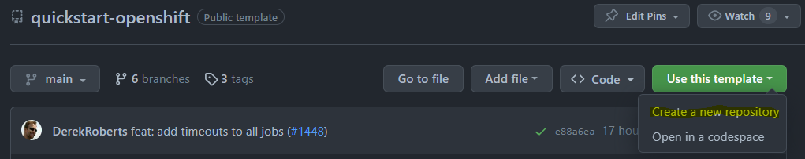
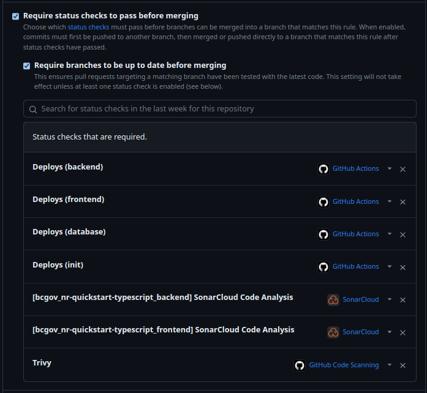
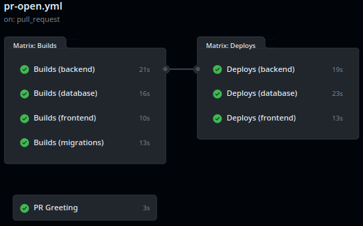
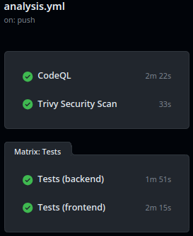
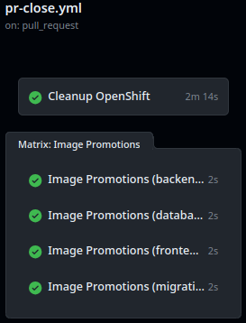
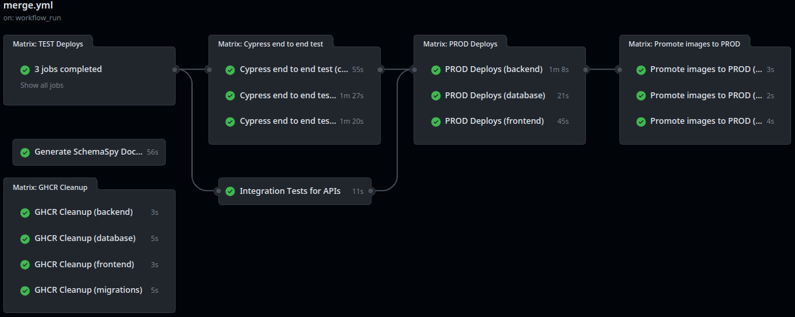
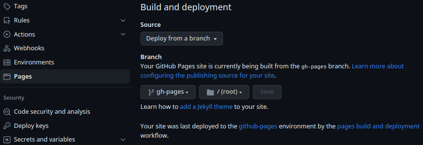

<<<<<<< HEAD
# nr-spar-data-sync

Engine to sync data for SPAR application (from Postgres to Oracle). The application extracts, transforms, and loads data based on a few parameters/configurations.

## Running the application
The application has a **main.py** module with a main function that triggers the data synchronization process based on parameters/configurations described on the next session.

## Configuring each domain (source and target tables)
A domain folder has to be created for each domain to be synced. For example, the seedlot domain will sync a few tables that are related, such as SEEDLOT, SEEDLOT_GENETIC_WORTH, and SEEDLOT_PARENT_TREE.

Data to be extracted are defined on the **source.json** files as well as the select statements that will be executed.

A **target.json** file holds the target tables that will be synced with the mapping between source and target columns.

There are times when a table synchronization won´t be so simple and just column mapping won´t be enough. When more complex data manipulation needs to be performed, a transformation function named after the table being synced can be created on the **transformations.py** file, and changes can be made to the columns using Pandas DataFrame.

Lookups and stage tables can be defined on the **source.json** file and data from those tables can be used on the transformation function if needed.

There is also a **database_config.json** file that holds database parameters to be used in the process. That will be changed to fetch database credentials from Vault.

## How does the engine move data?
The engine extracts data for each domain at once, one table at a time. The order tables are extracted is defined in the **source.json** file within the domain. Data are filtered based on the process's last execution date - only records that were updated after the last execution date will be fetched. Also, records mapped to be retried on the **data_sync_error** table will also be retrieved.

Data transformation is performed only if necessary, and if so, a function should be created with all data manipulation in the **transformation.py** file The function will have access to all lookup/stage tables extracted.

There are two ways domains can be loaded. The first one is when all the tables in the domain are related and have a single column that drives them all - called in the process **leading_column**. For example, all tables on the seedlot domain have a seedlot_number column. In this case, all the tables in a domain will be synced for each **leading_column** value before committing the changes. If any database error happens then a rollback will undo all the changes made to the tables for that leading_column value, the value will be stored on the **data_sync_error** (and retried in the next execution) and the next **leading_column** value will start to be loaded.

The second way is when tables in a domain are not related to each other. In this case, the sync will happen one row at a time and if an error happens that row will be rollbacked and stored on the data_sync_error table.

Database errors during the load phase do not stop the process, it will roll back the related records, log them on data_sync_error, and move to the next record.

In order for the process to work, the source database schema should have two control tables: **data_sync_control** and **data_sync_error**. The first one will handle each execution, its status, start and end date and will be used by the process to define the date to be used to extract data incrementally. The second one will be used to log any database errors that happened during the load phase and will store the identification of the records that had problems so they can be retried in the next execution.

=======

##### Frontend (JavaScript/TypeScript)

##### Backend (JavaScript/TypeScript)

# QuickStart for OpenShift

## Pull Request-Based Workflows with Sample Stack

The is a fully functional set of [GitHub Actions](https://github.com/bcgov/quickstart-openshift/actions) workflows and a starter application stack intended to help Agile teams hit the ground running.

Features:
* Pull Request-based pipeline
* Sandboxed development environments
* Gateable production deployments
* Container publishing (ghcr.io) and importing (OpenShift)
* Security, vulnerability, infrastructure, and container scan tools
* Automatic dependency patching available from [bcgov/renovate-config](https://github.com/bcgov/renovate-config)
* Enforced code reviews and workflow jobs (pass|fail)
* Helm Package Manager for atomic deployments
* Prometheus Metrics export from Backend/Frontend
* Resource Tuning with Horizontal Pod Autoscaler (in TEST/PROD).
* Self Healing through Health checks
* Sample application stack:
    * Database: Postgres, PostGIS, backups
    * Frontend: TypeScript, Caddy Server
    * Backend: TypeScript, Nest.js
    * Alternative backends for [Java/Quarkus, Go/Fiber and Python/FastAPI](https://github.com/bcgov/quickstart-openshift-backends)

# Table of Contents

* [Setup](#Setup)
  * [Prerequisites](#Prerequisites)
  * [Using this Template](#Using-this-Template)
  * [Secrets and Variables](#Secrets-and-Variables)
  * [Environments](#environments)
  * [Updating Dependencies](#Updating-Dependencies)
  * [Repository Configuration](#Repository-Configuration)
* [Workflows](#Workflows)
  * [Pull Request](#Pull-Request)
  * [Analysis](#Analysis)
  * [Pull Request Closed](#Pull-Request-Closed)
  * [Merge](#Merge)
* [App Stack](#App-Stack)
  * [Starter](#Starter)
  * [Pluggable Backends](#Pluggable-Backends)
  * [SchemaSpy](#SchemaSpy)
* [Resources](#Resources)
* [Contributing](#Contributing)

# Setup

Initial setup is intended to take an hour or less.  This depends greatly on intended complexity, features selected/excluded and outside cooperation.

## Prerequisites

The following are required:

* BC Government IDIR accounts for anyone submitting requests
* [GitHub accounts](https://github.com/signup) for all participating team members
* Membership in the BCGov GitHub organization
    * Provide GitHub IDs to [BCGov's Just Ask](https://just-ask.developer.gov.bc.ca/)
* OpenShift project namespaces:
    * [BCGov signup](https://registry.developer.gov.bc.ca)

## Using this Template

Create a new repository using this repository as a template.

* Verify bcgov/quickstart-openshift is selected under Repository template

## Secrets and Variables

Variables and secrets are consumed by workflows.  Environments provide their own values, overriding default sets.

Secrets are hidden from logs and outputs, while variables are visible.  Using secrets exclusively can make troubeshooting more difficult.

Note: Dependabot, which we don't recommend as highly as Renovate, requires its own set of variables.

### Secrets Values

> Click Settings > Secrets and Variables > Actions > Secrets > New repository secret

**GITHUB_TOKEN**

Default token.  Replaced every workflow run, available to all workflows.
* Consume: `{{ secrets.GITHUB_TOKEN }}`

**OC_TOKEN**

OpenShift token, different for every project/namespace.  This guide assumes your OpenShift platform team has provisioned a pipeline account.

* Consume: `{{ secrets.OC_TOKEN }}`

Locate an OpenShift pipeline token:

1. Login to your OpenShift cluster, e.g.: [Gold](https://console.apps.silver.devops.gov.bc.ca/) or [Silver](https://console.apps.silver.devops.gov.bc.ca/)
2. Select your DEV namespace
3. Click Workloads > Secrets (under Workloads for Administrator view)
4. Select `pipeline-token-...` or a similarly privileged token
5. Under Data, copy `token`
6. Paste into the GitHub Secret `OC_TOKEN`

**OC_NAMESPACE**

OpenShift project/namespace.  Provided by your OpenShift platform team.

* Consume: `{{ secrets.OC_NAMESPACE }}`
* Value: format `abc123-dev | test | prod`

**SONAR_TOKEN(s)**

If SonarCloud is being used each application will have its own token.  Single-application repositories typically use `${{ secrets.SONAR_TOKEN }}`, while monorepos use similar names.

E.g.:
* `${{ secrets.SONAR_TOKEN_BACKEND }}`
* `${{ secrets.SONAR_TOKEN_FRONTEND }}`

BC Government employees can request SonarCloud projects by creating an [issue](https://github.com/BCDevOps/devops-requests/issues/new/choose) with BCDevOps.  Please make sure to request a monorepo with component names (e.g. backend, frontend), which may not be explained in their directions.

### Variable Values

> Click Settings > Secrets and Variables > Actions > Variables > New repository variable

**OC_SERVER**

OpenShift server address.
* Consume: `{{ vars.OC_SERVER }}`
* Value: `https://api.gold.devops.gov.bc.ca:6443` or `https://api.silver.devops.gov.bc.ca:6443`

## Environments

Environments are groups of secrets and variables that can be gatekept.  This includes limting access to certain users or requiring manual approval before a requesting workflow can run.  Environment values override any default values.

For pull requests and development surrounding lower-level, sandboxed environments it is best not to use an environment at all.  Higher level environments, like TEST and PROD, will override those values as necessary.

> Click Settings > Environments > New environment

Environments provide a [number of features](https://docs.github.com/en/actions/deployment/targeting-different-environments/using-environments-for-deployment), including:

* Required reviewers
* Wait timer
* Deployment branches

## Updating Dependencies

Dependabot and Mend Renovate can both provide dependency updates using pull requests.  Dependabot is simpler to configure, while Renovate is much more configurable and lighter on resources.

### Renovate

A config file (`renovate.json`) is included with this template.  It can source config from our [renovate repository](https://github.com/bcgov/renovate-config).  Renovate can be [self-hosted](https://github.com/renovatebot/github-action) or run using the GitHub App managed at the organization level.  For BC Government the OCIO controls this application, so please opt in with them using a GitHub issue.

To opt-in:
* Visit the [Renovate GitHub App](https://github.com/apps/renovate/)
* Click `Configure` and set up your repository
* Visit [BCDevOps Requests](https://github.com/BCDevOps/devops-requests)
* Select [Issues](https://github.com/BCDevOps/devops-requests/issues)
* Select [New Issue](https://github.com/BCDevOps/devops-requests/issues/new/choose)
* Select [Request for integrating a GitHub App](https://github.com/BCDevOps/devops-requests/issues/new?assignees=MonicaG%2C+oomIRL%2C+SHIHO-I&labels=github-app%2C+pending&projects=&template=github_integration_request.md&title=)
* Create a meaningful title, e.g. `Request to add X repo to Renovate App`
* Fill out the description providing a repository name
* Select "Submit new issue"
* Wait for Renovate to start sending pull requests to your repository

### Dependabot

Dependabot is no longer recommended as an alternative to Renovate for generating security, vulnerability and dependency pull requests.  It can still be used to generate warnings under the GitHub Security tab, which is only viewable by repository administrators.

## Repository Configuration

### Pull Request Handling

Squash merging is recommended for simplified history and ease of rollback.  Cleaning up merged branches is recommended for your DevOps Specialist's fragile sanity.

> Click Settings > General (selected automatically)

Pull Requests:

* `[uncheck] Allow merge commits`
* `[check] Allow squash merging`
   * `Default to pull request title`
* `[uncheck] Allow rebase merging`
* `[check] Always suggest updating pull request branches`
* `[uncheck] Allow auto-merge`
* `[check] Automatically delete head branches`

### Packages

Packages are available from your repository (link on right).  All should have visibility set to public for the workflows to run successfully.

E.g. https://github.com/bcgov/quickstart-openshift/packages

### Branch Protection

This is required to prevent direct pushes and merges to the default branch.  These steps must be run after one full pull request pipeline has been run.

1. Select Settings (gear, top right)  *> Branches (under Code and Automation)
2. Click `Add Rule` or edit an existing rule
3. Under `Protect matching branches` specify the following:
    * Branch name pattern: `main`
    * `[check] Require a pull request before merging`
        * `[check] Require approvals` (default = 1)
        * `[check] Dismiss stale pull request approvals when new commits are pushed`
        * `[check] Require review from Code Owners`
    * `[check] Require status checks to pass before merging`
        * `[check] Require branches to be up to date before merging`
        * `Status checks that are required`:
            * Select checks as appropriate, e.g. Build x, Deploy y
        * Select at least one status check to enforce branch protection
    * `[check] Require conversation resolution before merging`
    * `[check] Include administrators` (optional)

### Adding Team Members

Don't forget to add your team members!  

1. Select Settings (gear, top right)  *> Collaborators and teams (under `Access`)
2. Click `Add people` or `Add teams`
3. Use the search box to find people or teams
4. Choose a role (read, triage, write, maintain, admin)
5. Click Add

# Workflows

## Pull Request

Runs on pull request submission.

* Provides safe, sandboxed deployment environments
* Build action pushes to GitHub Container Registry (ghcr.io)
* Build triggers select new builds vs reusing builds
* Deployment triggers to only deploy when changes are made
* Deployment includes curl checks and optional penetration tests
* Other checks and updates as required

## Analysis

Runs on pull request submission or merge to the default branch.

* Unit tests (should include coverage)
* SonarCloud coverage and analysis
* CodeQL/GitHub security reporting
* Trivy password, vulnerability and security scanning

## Pull Request Closed

Runs on pull request close or merge.

* Cleans up OpenShift objects/artifacts
* Merge promotes successful build images to TEST

## Merge

Runs on merge to main branch.

* Code scanning and reporting to GitHub Security overview
* Zero-downtime* TEST deployment
* Penetration tests on TEST deployment
* Zero-downtime* PROD deployment
* Labels successful deployment images as PROD

\* excludes database changes

# App Stack

## Starter

The starter stack includes a (React, MUI, Vite, Caddy) frontend, Pluggable backend(Nest/Node, Quarkus/Java On Native, FastAPI/Python, Fiber/Golang) and postgres database.  See subfolder for source, including Dockerfiles and OpenShift templates.

Features:
* [TypeScript](https://www.typescriptlang.org/) strong-typing for JavaScript
* [NestJS](https://docs.nestjs.com) Nest/Node backend and frontend
* [Flyway](https://flywaydb.org/) database migrations
* [Postgres](https://www.postgresql.org/) or [PostGIS](https://postgis.net/) database
* [backup-container](https://github.com/BCDevOps/backup-container) provided by BCDevOps

Postgres is default.  Switch to PostGIS by copying the appropriate Dockerfile to `./database`:

> cp ./database/postgis/Dockerfile ./database

## Pluggable Backends

This quickstart works with more than just JavaScript.  Please check out our pluggable [backends repository](https://github.com/bcgov/quickstart-openshift-backends).  Flyway-based database migrations for each are included.

Supported languages:
* [Go with Fiber](https://github.com/bcgov/quickstart-openshift-backends/tree/main/backend-go)
* [Java with Quarkus, Cloud Native](https://github.com/bcgov/quickstart-openshift-backends/tree/main/backend-go)
* [Python with FastAPI](https://github.com/bcgov/quickstart-openshift-backends/tree/main/backend-py)

## SchemaSpy

The database documentation is created and deployed to GitHub pages.  See [here](https://bcgov.github.io/quickstart-openshift/schemaspy/index.html).

After a full workflow run and merge can been run, please do the following:

1. Select Settings (gear, top right)  *> Pages (under `Code and automation`)
2. Click `Branch` or `Add teams`
3. Select `gh-pages`
4. Click `Save`

# Resources

This repository is provided by NRIDS Architecture and Forestry Digital Services, courtesy of the Government of British Columbia.

* NRID's [Kickstarter Guide](https://bcgov.github.io/nr-architecture-patterns-library/docs/Agile%20Team%20Kickstarter) (via. Confluence, links may be internal)
* [OpenShift Backends for Go, Java and Python](https://github.com/bcgov/quickstart-openshift-backends)

# Contributing

Please contribute your ideas!  [Issues](/../../issues) and [Pull Requests](/../../pulls) are appreciated.
>>>>>>> 5cb9c88 (Initial commit)
